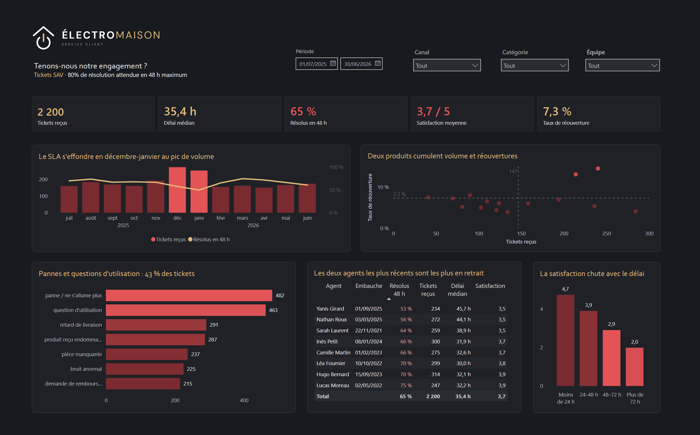

# 🎧 ÉlectroMaison – Analyse de la performance du service client

Projet d'analyse de données réalisé avec **Power BI**, à partir des données fictives d'ÉlectroMaison, une enseigne spécialisée dans l'électroménager.

L'objectif est de construire un dashboard interactif permettant de mesurer le respect de l'engagement de service client : **80 % des tickets SAV résolus en 48 h maximum**.

> 📅 Analyse réalisée le 4 octobre 2026
> 📊 Période analysée : juillet 2025 – juin 2026

---

## 🎯 Objectifs

Cette analyse vise à répondre aux questions suivantes :

- L'engagement de résolution en 48 h est-il tenu, et à quels moments décroche-t-il ?
- Quels motifs génèrent le plus de tickets ?
- Quels produits concentrent volume de tickets et réouvertures ?
- Comment la performance varie-t-elle d'un agent à l'autre ?
- Quel est l'impact du délai de résolution sur la satisfaction client ?

---

## 🗂️ Données

Les données couvrent notamment :

- Les tickets SAV (date d'ouverture, de résolution, canal, motif, statut)
- Les produits et catégories
- Les agents et leur date d'embauche
- Les notes de satisfaction client

**Méthodologie :** les délais sont calculés en heures calendaires (week-ends inclus), du point de vue du client.

---

## 🔎 Analyses

### 1. Respect de l'engagement
Suivi des tickets reçus, du délai médian, du taux de résolution en 48 h et de la satisfaction.

### 2. Saisonnalité
Évolution mensuelle du volume de tickets et du taux de résolution en 48 h.

### 3. Motifs et produits
Répartition des tickets par motif et identification des produits combinant volume et réouvertures.

### 4. Performance des agents et satisfaction
Comparaison des agents et analyse de la satisfaction selon le délai de résolution.

---

## 📊 Dashboard

Les filtres permettent d'explorer les résultats par période, canal, catégorie et équipe.

---

## 💡 Principaux insights

Sur 2 200 tickets, **65 % sont résolus en 48 h**, soit **15 points sous l'objectif de 80 %**, pour un délai médian de **35,4 h**.

Le taux de résolution **s'effondre en décembre-janvier** (58 % puis 50 %), au moment du pic de volume, ce qui révèle un dimensionnement des équipes inadapté à la saisonnalité.

**Les pannes et les questions d'utilisation représentent 43 % des tickets.** Ces dernières (463 tickets) pourraient en grande partie être absorbées par des contenus d'aide en libre-service.

Deux produits, l'**Aspirateur balai Cyclone** et la **Machine expresso Barista**, concentrent **21 % des tickets** avec un taux de réouverture près de **deux fois supérieur à la moyenne**.

Les **deux agents les plus récemment embauchés** affichent les taux de résolution les plus bas (53 % et 56 %), et aucun agent n'atteint l'objectif de 80 %.

Enfin, **la satisfaction chute de 4,7 / 5 à 2 / 5** lorsque le délai de résolution dépasse 72 h, ce qui fait du respect des 48 h un enjeu direct d'expérience client.

Les résultats détaillés et les recommandations sont disponibles dans le fichier [`business_insights.md`](business_insights.md).

---

## 🛠️ Outils & technologies

- Power BI
- Power Query
- DAX
